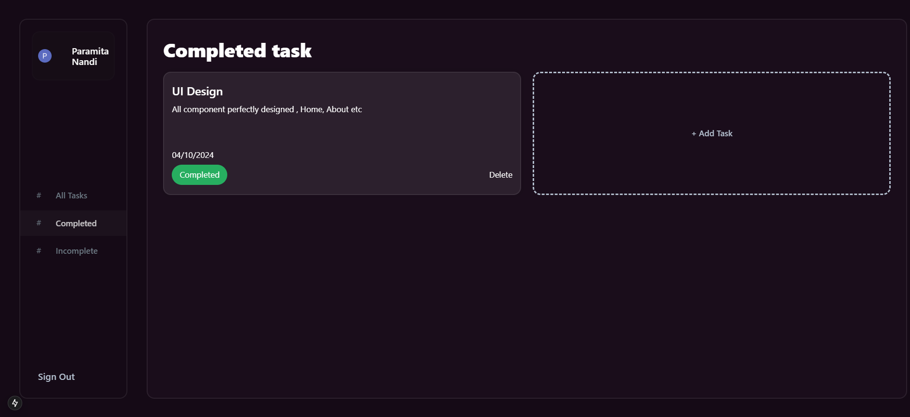

# Todo List

While it resembles a simple todo list, this application offers much more. It includes email-based authentication, user profile management, and the ability for users to easily update their status with just one click. The task list supports sorting by completed and incomplete items, and users can search for specific tasks. Additionally, pagination is implemented for enhanced navigation.


## Benefits

 - Authentication System
 - Status Update
 - Task Wise Search
 - Pagination Benefits
 - Manage your profile


## Technologies Used

 - Next.js - A React framework for server-rendered applications.
 - TypeScript - A typed superset of JavaScript for better development experience.
 - Styled-components - For styling React components.
 - Prisma - A modern ORM for database interaction.
 - Clerk - For authentication.
 - Axios - For making HTTP requests.
 - React Hot Toast - For notifications.
 - Moment.js - For date formatting.
 - Next.js Loader - For loading indicators.
## Getting Started

### Frontend Setup

- Clone the repository:
```bash
git clone [repository-url]
cd [repository-name]
```

- Install dependencies:
```bash
npm install
```

- Set up your Next.js environment:
```bash
npm run dev
```
### Authentication
- Implement authentication using Clerk:
    - Follow the Clerk documentation for setup instructions.

### API Setup
- Set up Prisma for database interaction:
```bash
npx prisma init
```
- Configure your database in the prisma/schema.prisma file.
- Create API routes for CRUD operations:
    - Implement error handling for each operation (POST, GET, PUT, DELETE).

### Usage
- Start the development server:
```bash
npm run dev
```
- Open your browser and navigate to http://localhost:3000 to see your application in action.



